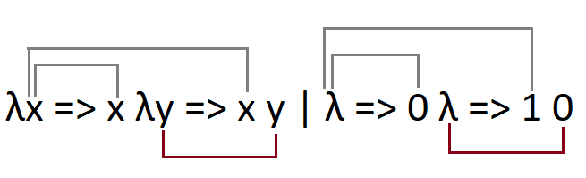

# De Bruijn Index
- λx => λy => x y | λ => λ => 1 0 (1, 0 stehen für den De Bruijn Index)
- Relativer pfad
- Die an der selben stelle gebunbene Variable kann verschiedene Indices haben
- Bsp.  λx => x λy => x y | λ => 0 λ => 1 0 (1, 0 stehen für den De Bruijn Index)
